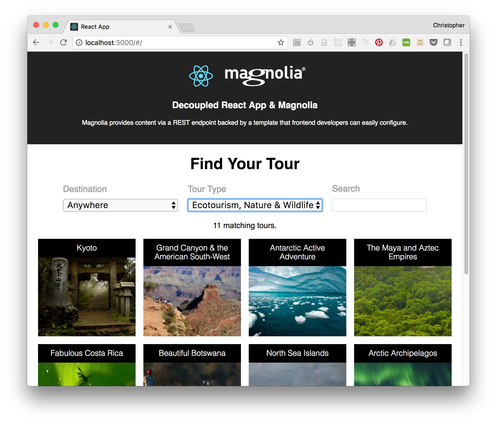
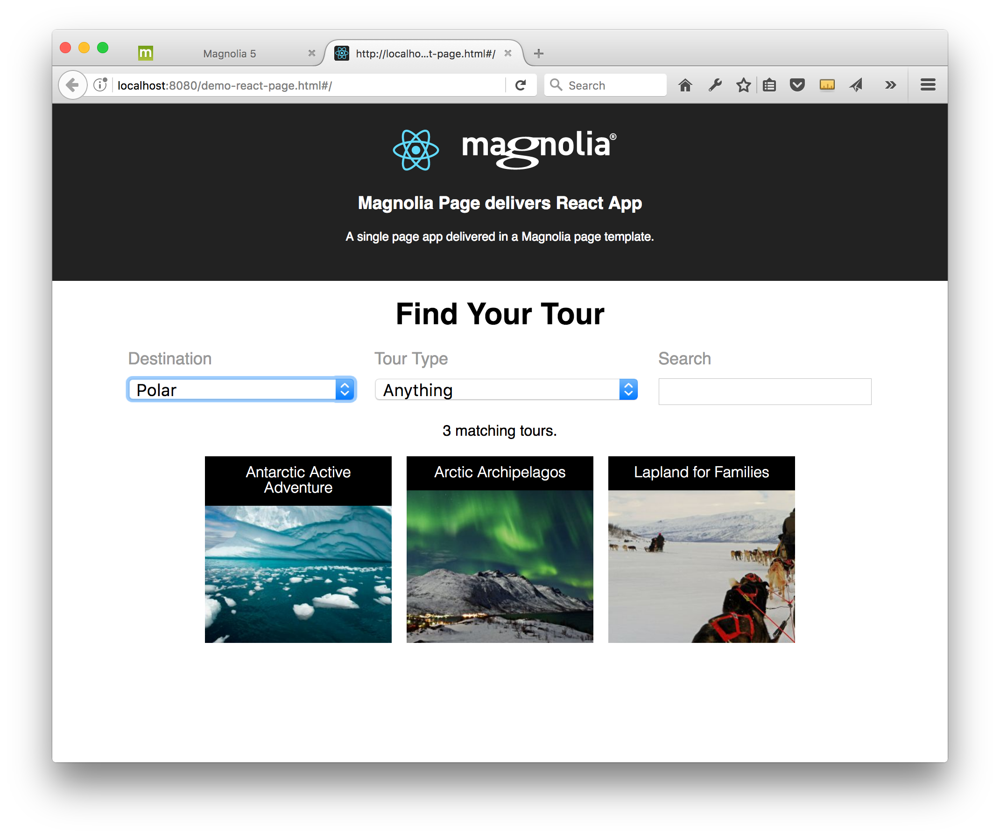
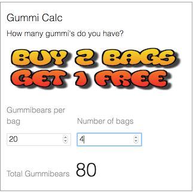
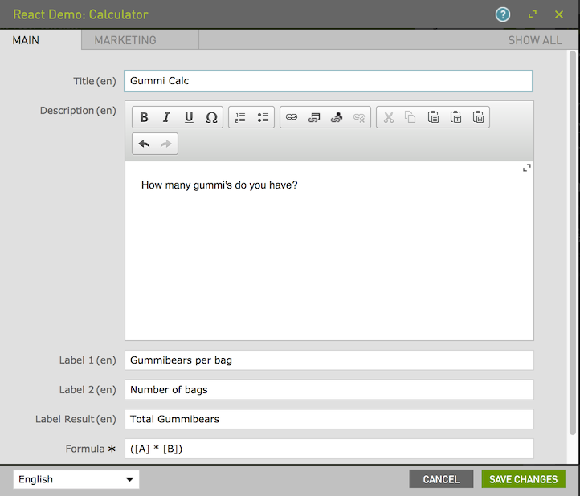
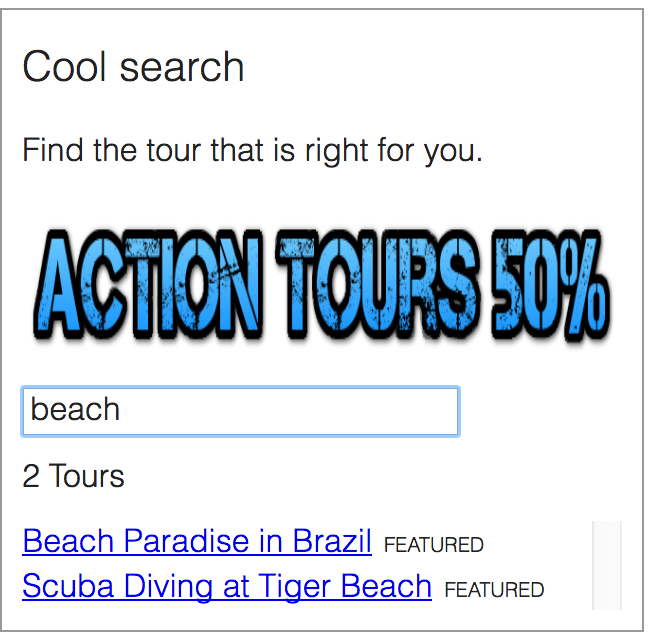
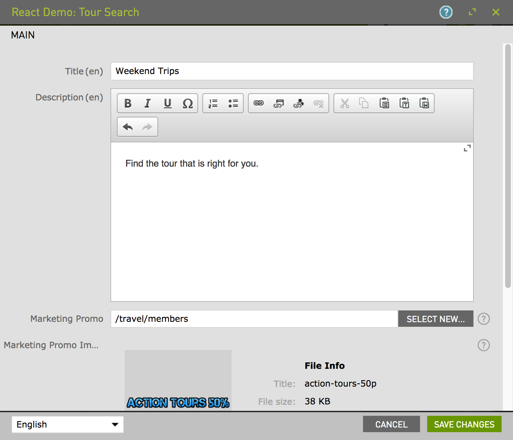

# react-demos

Demonstrates how you can `content manage your React app` using three techniques:
* __Decoupled__: An independent React App accesses Magnolia stored content in a 'headless'/'decoupled' fashion.
* __Magnolia Page__: A SPA (single page app) React app can be supplied in a Magnolia page template.
* __Magnolia Components__: Magnolia components can encapsulate React Apps, allowing content authors to configure them and add them to pages.

It demonstrates these `content manage your React app` use cases :
* __Content Pool__: Content can be managed in a Magnolia content app.
* __Configure__: Author can configure the formula used.
* __Labels & i18n__: Author can supply labels for apps, and in multiple languages.
* __Marketing__: Author can supply `Marketing promotion content` in the form links, texts and images.

# Features - 1.Decoupled

# 2. Features - Magnolia Page

# 3. Features - Magnolia Components

## react-calculator

A simple web based calculator that applies an author specified formula to two values.

## react-tour-search

A widget which lists content from a REST source and allows filtering via a `search` input field.

# Demo

Get magnolia with `mgnl jumpstart`, or point your existing instance to the provided `light-modules` directory.

In the 'Admin central' Pages app, import all the `website...` files from `_dev/demos`.

In the Assets app, import he `dam...` files from `_dev/demos`.

Open the various pages that have been imported.

Note that 'decorations' are provided so that two components are available in the MTK basic page, and the Travel demo pages.

## Demo - Decoupled / Headless scenario.
Ensure Magnolia is running.

Ensure that the base url to access the content on the Magnolia server is correct: In file `/react-tours-headless/public/index.html`, check that the `window.MAGNOLIA_BASE_URL` has the correct value for your server.

Open a terminal in `/react-tours-headless` directory.

Type `npm run`

A browser will open running an independent React App - and pulling content from Magnolia content apps.

# Notes
The `react-tours-headless` and the Page demo run the same React build.

That app is based on the `create-react-app` project and can be built with the `npm run build` command.

The build generated in `/react-tours-headless/build` directory has been copied to `/light-modules/react-demo-page/webresources/build`.

The app is built to accept 'parameters' via the JS window global object. In the decoupled scenario the app gets the tours content via REST. In the page template, the content is supplied directly in the page and no additional request is required.

For the decoupled example, and the react-tours-search component rely on a page for their REST content. This page acts as an endpoint. The endpoint template is supplied in `/light-modules/tours-json` module. The page in magnolia must be named `tours-endpoint` (This page is supplied in the `_dev/demos` bootstraps. )

## Information on Magnolia CMS
This directory is a Magnolia 'light module'.

https://docs.magnolia-cms.com

Search the docs for `sharing light modules` for details on how to share and use light modules on npm and github.

## License

MIT

## Contributors

Magnolia, https://magnolia-cms.com

Christopher Zimmermann, @topherzee
